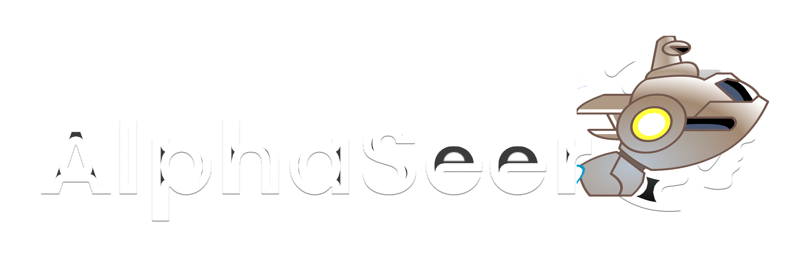

我们在本仓库内提供了AlphaSeer的实现，为了方便理解，我们将从文件目录，运行方式分开讲解。

> **作者**
>
> 仓库地址: https://github.com/Starlitnightly/AlphaSeer/
> 
> 星夜: Starlitnightly@163.com

## 文件目录

- img: 雷伊和盖亚的图片
- logs: 存放着AlphSeer的训练过程
- `alphaseer_rl.ipynb`: 该文件是训练AlphaSeer主文件
- `genie.py`: 精灵属性
- `logon_new.py`: 幼稚版赛尔号实现与AlphaSeer实现逻辑函数
- `DQN_Seer_best.zip`: AlphaSeer最好的模型

## 运行方式

### 安装环境

我们使用pytorch运行强化学习的环境
```shell
conda create -n seer python=3.9
conda activate seer
#GPU
conda install pytorch torchvision torchaudio pytorch-cuda=11.8 -c pytorch -c nvidia
#CPU
conda install pytorch torchvision torchaudio cpuonly -c pytorch
#MAC
conda install pytorch::pytorch torchvision torchaudio -c pytorch

#国内安装可加上清华源
pip install gymnasium -i https://pypi.tuna.tsinghua.edu.cn/simple
pip install stable_baselines3 -i https://pypi.tuna.tsinghua.edu.cn/simple
pip install pyQt6 -i https://pypi.tuna.tsinghua.edu.cn/simple

```

### 运行

我们使用以下代码生成模型

```python
from stable_baselines3 import DQN
from stable_baselines3.common import logger
from logon_new import AlphaSeer

#初始化AlphaSeer环境
env = AlphaSeer()

#设置AI玩家agent
agent = DQN('MlpPolicy', env, verbose=0,tensorboard_log='logs')

#对战场次定为50万次
agent.learn(total_timesteps=500000, log_interval=100,tb_log_name='DQN')

#保存模型
agent.save("DQN_Seer")
```

我们使用以下代码打开Tensorboard查看模型训练过程

```shell
tensorboard --logdir logs serve
```

我们使用以下代码测试模型效果（文本版）

```python
from stable_baselines3 import DQN

# 创建环境（请确保此处的环境配置与训练时的环境配置一致）
env = AlphaSeer()

# 加载训练好的智能盖亚
trained_model = DQN.load("DQN_Seer_best")

# 在环境中使用智能盖亚进行预测
obs = env.reset()  # 重置环境状态
done = False

#状态计数器
k=0
while not done:
    if k==0:
        obs=obs[0]
    action, _ = trained_model.predict(obs)  # 使用模型预测动作
    
    #预测模型动作
    obs, reward, done, _,info = env.step_info(action.reshape(-1)[0])  # 执行动作并获取新的状态、奖励和终止信息

    #打印模型的动作、奖励、终止信息
    print(reward,info)
    k+=1

```

我们使用以下代码打开pyqt6测试模型效果

```shell
python logon_new.py
```


## 其他说明

未经许可，禁止用于任何商业用途，请遵循GPL3.0协议
